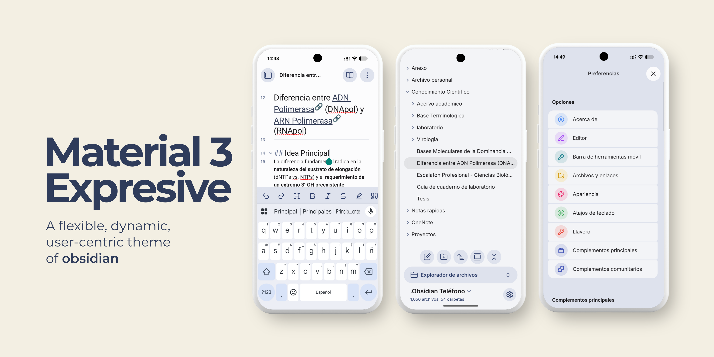
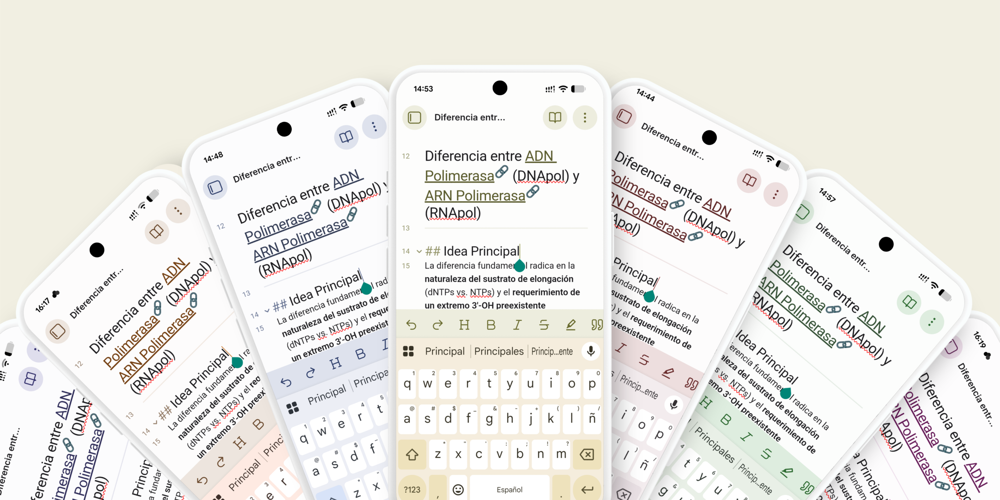
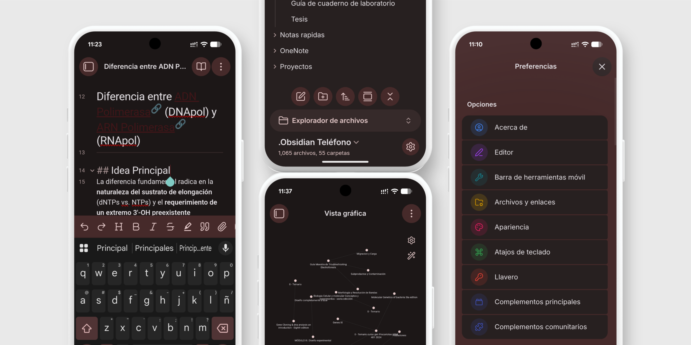
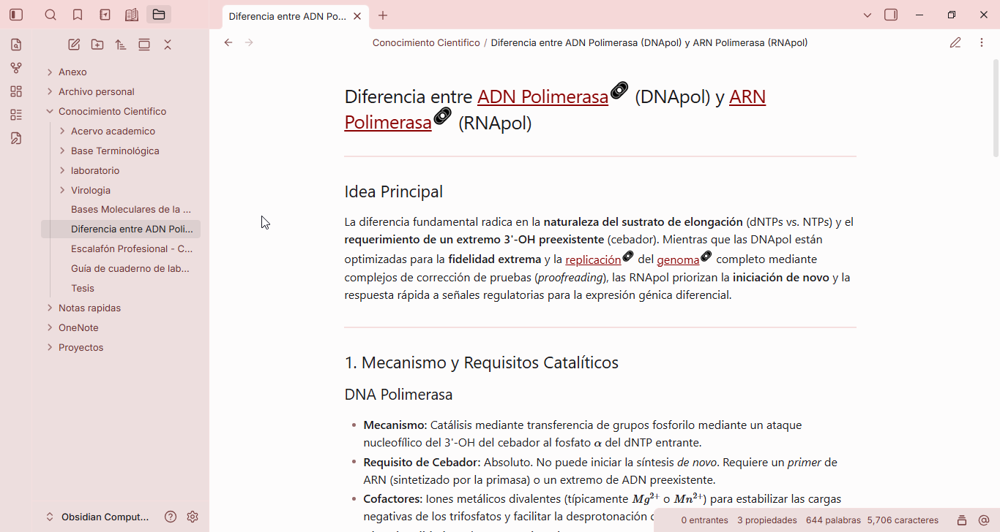

# Material 3 Expressive

An Obsidian theme based on **Material You** and **Android 16** guidelines.
Designed to offer a fluid experience with rounded shapes, expressive typography, and grouped lists.

## ✨ Features

- **Dynamic Colors:** Generates complete tonal palettes (surfaces, containers, accents) from a single base hue to fully align with Material You.
  

- **Adaptive Dark Mode:** An elegant dark design that adapts primarily to your chosen accent color, giving you a wide variety of personalized color choices.
  

- **Grouped Lists:** Native Android 16 style for settings and navigation menus.
- **Desktop Version in Progress:** We are actively working to make the desktop version as polished and native-feeling as the mobile version!
  

## 🚀 Installation

### Via Community Themes (Recommended)
1. Open Obsidian > Settings > Appearance.
2. Under "Themes", click "Manage".
3. Search for **Material Color** (or Material 3 Expressive) and click "Install", then "Use".

### Manual Installation
1. Download and extract this ZIP file.
2. Place the extracted folder into your Obsidian vault at: `.obsidian/themes/`
3. Open Obsidian > Settings > Appearance > Themes and select **Material Color** (or Material 3 Expressive).

## 🔌 Supported Plugins

This theme includes native design support for community plugins perfectly integrated with the Material 3 aesthetic:

- **[Notebook Navigator](https://github.com/johansan/notebook-navigator)**
- **[Highlightr](https://github.com/chetachiezikeuzor/Highlightr-Plugin)**

## 🐹 Fuel the Hamster 

**Love the theme?** You can support its development by buying me a **sunflower seed** 🌻. Your appreciation allows me to dedicate more time to polishing details and adding features.

## ⚙️ Development Note

> [!IMPORTANT]
> **Version Status v1.0.0**
>
> Material-3-Expressive is currently in an active optimization phase. Although the Android 16-inspired visual base is mostly functional and stable, the project is under continuous refinement.

## ⚖️ Disclaimer & License

This is an independent project inspired by Google's Material Design guidelines and is not affiliated with or endorsed by Google LLC.

MIT License © 2026 JoanGen
